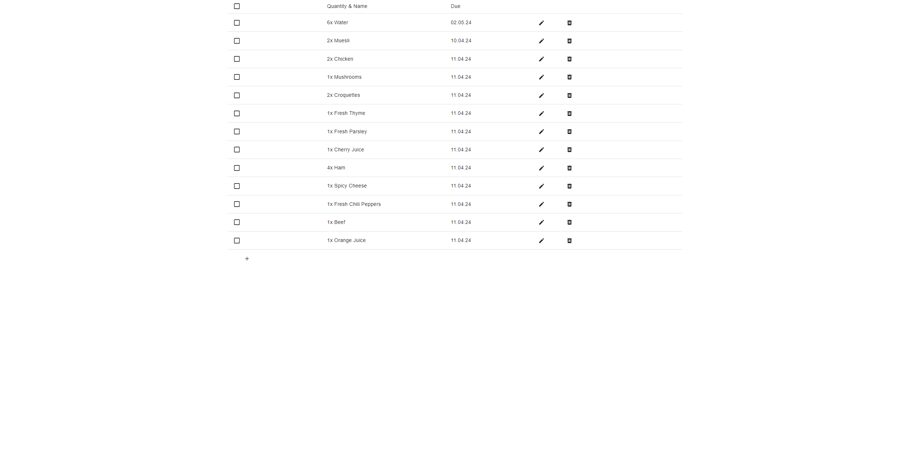
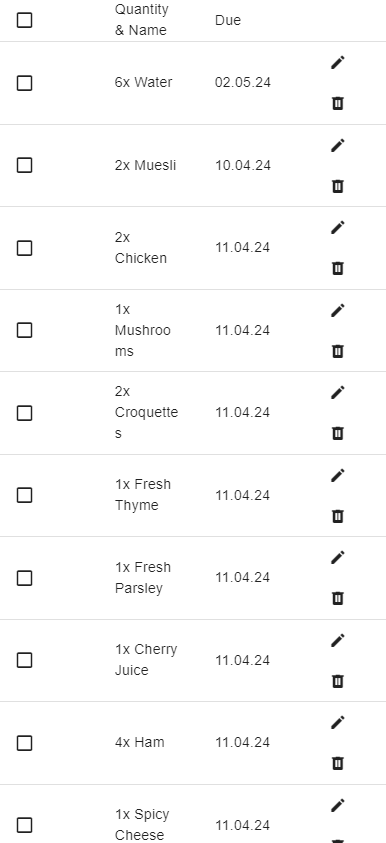

## Example VueJS App for Elevator GmbH 🌱
This is a coding challenge made for Elevator GmbH. It features a fully functional shopping list PWA made with Vue.js 3 and Vuetify, storing its data in the local storage.

### Task
The task is to develop a shopping planner app (Product, Quantity, Optional Due Date, Not Done/Done) with very basic functionality (add/edit/delete product). 
The implementation should be as a Progressive Web App (PWA) developed with the JS framework Vue.js and Material Design. The PWA should be responsive and operable on a desktop, tablet, and smartphone.  
There are no specific visual guidelines, so you are free to be creative. However, the focus is not on the design but on the technical implementation. Please create at least one test.  
The application can optionally be extended by 2 PWA features:

1. The data should be stored in the browser's local storage.
2. When the due date is reached, a push notification should be sent.

### Implementation
I have used a basic installation of Vue 3 with **no backend** for this challenge. 
I have implemented the task inside of 2 Vue components: ShoppingListView handles most functionality, while EditProductDialog manages editing a single entry via a popup dialog. 
Additionally there is a utils folder holding all re-usable code. 

To achieve the wanted functionality with simple and modern UI design I used the following libraries:
- **Vuetify** - A **Material Design** Vue component framework.
- **I18n** - A internationalization-framework hooked up to browser settings.
- **vue-screen-size** - Provides screen sizing as global variables.
- **Jest** - Unit testing using Jest.
- **Self written basic SCSS 👷‍♀️** - A small SCSS library containing responsive styling.

❗ The project has **no backend**, which means I did not implement push notifications. ❗ 

**Desktop View** 

**Mobile View** 

### How to run
- **Install** - cd ./client 👉 npm i
- **Run** - cd ./client 👉 npm run serve
- **Build** - cd ./client 👉 npm run build
- **Test** - cd ./client 👉 npm run test:unit
